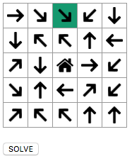
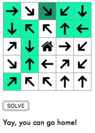

# arrow-maze
Return home by following directions. 
Here I use React to create a basic interactive solution and a Breadth First Search that takes into account the possible directions to identify the possible states reachable from a given state.

## Screenshots
   

## Description  
Challenge #325 from [/r/dailyprogrammer](https://www.reddit.com/r/dailyprogrammer/comments/6rb98p/20170803_challenge_325_intermediate_arrow_maze/?ref=share&ref_source=link):  

We want to return home, but we have to go trough an arrow maze.
We start at a certain point an in a arrow maze you can only follow the direction of the arrow.
At each node in the maze we can decide to change direction (depending on the new node) or follow the direction we where going.
When done right, we should have a path to home.  

## Formal Inputs &amp; Outputs

### Input description

You receive on the first line the coordinates of the node where you will start and after that the maze.
`n ne e se s sw w nw` are the direction you can travel to and `h` is your target in the maze.

    (2,0)
     e se se sw  s
     s nw nw  n  w
    ne  s  h  e sw
    se  n  w ne sw
    ne nw nw  n  n

### Output description

You need to output the path to the center. 

## Credits
* Arrow icon made by [Eleonor Wang](https://www.flaticon.com/authors/eleonor-wang) from [www.flaticon.com ](www.flaticon.com).
* Home icon made by [Dave Gandy](https://www.flaticon.com/authors/dave-gandy) from [www.flaticon.com ](www.flaticon.com).